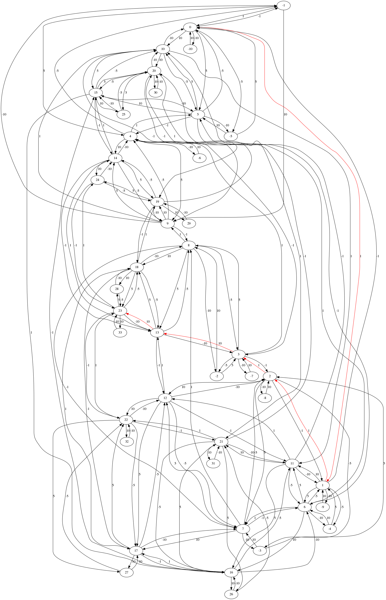

# Coin change com Djikstra

## Contexto
Bem, antes de tudo, essa ideia é totalmente baseada [nesse artigo](http://noenthuda.com/blog/2016/12/02/coin-change-problem-with-change-dijkstras-algorithm/)

Agora, contextualizando:
Todos conhecemos o famigerado problema do coin-change (ou change-making), que consiste, basicamente, em conceder a menor quantidade possiveis de moedas (ou notas etc) para pagar uma certa quantia.
```
Exemplo:
Tenho que pagar 56 centavos à alguem; e, para isso, poderia pagar com 56 moedas de 1 centavo.
Entretanto, a solução ótima (no que tange a quantidade de moedas), no sistema monetário brasileiro, seria:
50c + 5c + 1c, totalizando, obviamente, 3 moedas.
```

Entretanto, esse problema normalmente não leva em consideração a possibilidade do <i>Outro</i> me devolver uma certa quantia (<i>cashback</i>) para facilitar o pagamento.
```
Exemplo:
Tenho que pagar 99 centavos à alguem.
Dou a ele 1 real (100 centavos) e ele me devolve 1 centavo.
Total de moedas = 2

Já na solução ótima da implementação original do coin-change, o resultado seria:
50+25+10+10+1+1+1+1
Total de moedas = 8
```

Então, para isso surge essa solução.
Consiste basicamente nisso:
* Todas as quantias viram nós (de 1 a N, sendo N a maior quantia (o maior entre: **maior moeda** e **o quanto hei de pagar**))
* Moedas negativas são incluídas (para o cashback funcionar)
    * ```
        ex:
        se o sistema monetário é: {1, 5, 10}
        as moedas serão: {-1, -5, -10, 1, 5, 10}
       ```
* Dois nós possuem uma aresta entre si caso a diferença entre os dois possa ser paga por apenas 1 moeda (incluindo as negativas)

É isso.

## Rodando o Programa

Para rodar o programa, basta:
```
$ g++ djikstra.cpp
$ ./a.out
[sistema monetario]
0
[quantia à ser paga]

exemplo:
$ ./a.out
Insira as moedas/os valores que compõem o sistema monetário (Insira 0 para parar):
1 2 5 10 20 50 100
0
Insira o troco:
99
Moedas utilizadas:
1x -1c(cashback)
1x 100c
Quantidade total de moedas utilizadas: 2
```

## Visualização
Há ainda a possibilidade de se visualizar o grafo gerado para se encontrar a solução; entretanto, vale ressaltar que caso hajam muitas moedas e/ou a quantia seja "alta", o programa ficará rodando por um tempo indefinidamente longo*.
Um exemplo de caso em que se demora muito é [este](in).

** Obs: O programa em si (de calcular a quantidade de moedas) rodará em um tempo curto, o que demora pra processar é a geração da imagem.

Enfim, para se visualizar, há de se ter:
* [xdg-open](https://linux.die.net/man/1/xdg-open) (padrão nos Linux)
* [dot (graphviz)](https://www.graphviz.org/)

Para incluir a visualização, basta adicionar o parâmetro "sim":
```
$ ./a.out sim
...
```

Um exemplo de imagem resultante é esta abaixo, que veio dessa [entrada](in2) (e resultou neste [arquivo dot](vis.dot)):
```
Sistema monetário: {1, 5, 10}
Quantia à ser paga: 23
```




## Referência

[Coin change problem with change – Dijkstra’s Algorithm](http://noenthuda.com/blog/2016/12/02/coin-change-problem-with-change-dijkstras-algorithm/)
